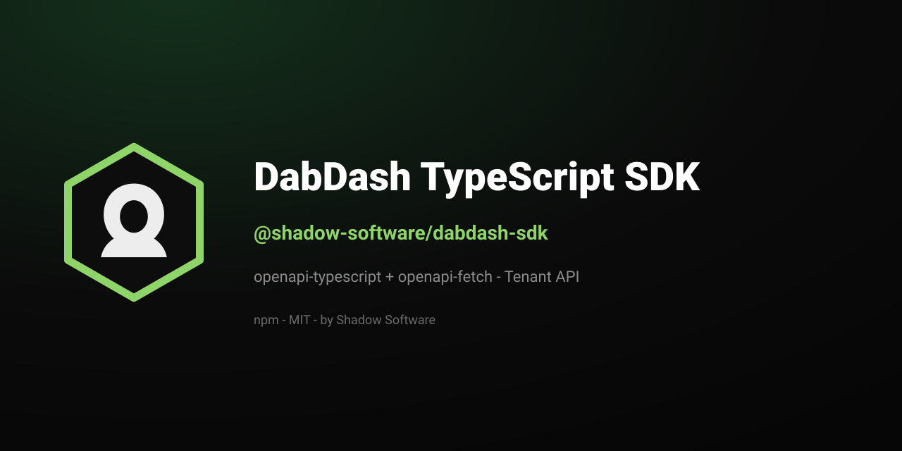

<p align="center">
  
</p>

<h1 align="center">DabDash TypeScript SDK</h1>

<p align="center">
  <strong>Official TypeScript client for the
  <a href="https://dabdash.com/">DabDash</a> Tenant API.</strong><br>
  Typed with <code>openapi-typescript</code> + <code>openapi-fetch</code>.
  Same tools as the tenant MCP server — transport differs, behavior does not.
</p>

<p align="center">
  <a href="https://www.npmjs.com/package/@shadow-software/dabdash-sdk"></a>
  
  <a href="https://shadowsoftware.com/"></a>
</p>

<p align="center">
  <b><a href="https://www.npmjs.com/package/@shadow-software/dabdash-sdk">npm →</a></b>
  &nbsp;·&nbsp;
  <a href="https://github.com/shadow-software/dabdash-php-sdk">PHP SDK</a>
  &nbsp;·&nbsp;
  <a href="https://github.com/shadow-software/dabdash-sync-for-wordpress">WordPress plugin</a>
</p>

---

## Install

```bash
npm install @shadow-software/dabdash-sdk
```

## Usage

```ts
import { createDabDashTenantClient } from "@shadow-software/dabdash-sdk";

const client = createDabDashTenantClient({
  apiKey: process.env.DABDASH_API_KEY!,
  tenantSlug: "your-tenant",
  // baseUrl defaults to https://dabdash.com
});

// slug is threaded into every tool path for you
await client.callTool("/api/v1/dabdash/tenant/{slug}/tools/customer_lookup", {
  body: { /* … */ },
});
```

`src/generated/` is regenerated from the OpenAPI spec — do not edit by hand.
Releases are produced by
[`shadow-software/sdk-release`](https://github.com/shadow-software/sdk-release).

## License

[MIT](LICENSE) © [Shadow Software LLC](https://shadowsoftware.com/).

---

## Also by Shadow Software

| | |
|---|---|
| [`shadow-software/dabdash-php-sdk`](https://github.com/shadow-software/dabdash-php-sdk) | DabDash Tenant API (PHP) |
| [`@shadow-software/agt-sdk`](https://github.com/shadow-software/agt-sdk) | AGT Dealer API (TypeScript) |
| [DabDash Sync for WordPress](https://github.com/shadow-software/dabdash-sync-for-wordpress) | WordPress plugin |

<p align="center">
  <sub><a href="https://shadowsoftware.com/">shadowsoftware.com</a> · MIT · © 2026 Shadow Software LLC</sub>
</p>
